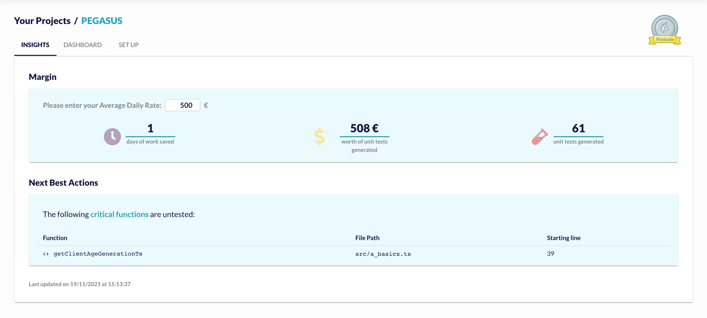
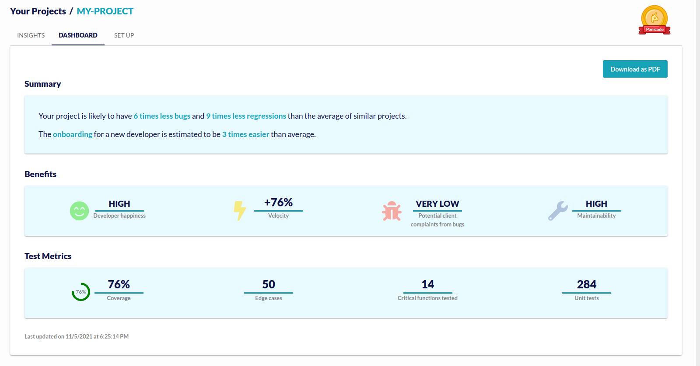

Ponicode TurboCov is an all-in-one solution to generate 80% code coverage on TypeScript backend projects and get access to a code quality dashboard.

#### Language support

TurboCov is available for **TypeScript** back-end projects.

> **Coming soon**: ***JavaScript***, ***Python***, ***Java***

#### Access

The full range of TurboCov functionalities is only available to users who subscribed to the [Premium plan](https://app.ponicode.com/account/billing/plan).

#### Get started

The best way to get started with TurboCov is to head to [app.ponicode.com](https://app.ponicode.com/turbocov) and follow the instructions to start a new project.

You will need the npm package [Ponicode CLI](cli/how-to.md) in order to link your project to TurboCov.

You can link your project to TurboCov using the npm package [Ponicode CLI](cli/how-to.md)

#### What data is recovered by Ponicode?

Ponicode will **not** save your code or your tests at any time when calling the `ponicode test` or `ponicode run` commands. We only extract the metrics that will be used for the calculation of the dashboard indicators.

<!--
- Number of generated unit tests
- Number of generated unit edge cases
- Number of function tested by Ponicode
- Coverage
- Name (and file path) of some untested functions
- File path of tested functions -->

#### Access to your dashboards and insights

On [your project's list](https://app.ponicode.com/turbo-cov/projects), you can select a project to see details about it.

If you don't see any projects listed on this page, 

### Insights

    

#### Understand you KPIs

* **Margin**: The Margin section is targeted specifically at Freelance developers. It estimates the amount of time it would have taken to write the same amount of tests as Ponicode manually, as well as the billable amount for this amount of time - based on your Average Daily Rate.
Figures are based on industry-standard statistics.
* **Next Best Actions**: Not every and all functions can be unit tested by Ponicode today. However, Ponicode is able to indicate to you which ones are the most important functions that you should direct your attention to, among the untested ones. In this section you can find a list of untested critical functions, so that you can go and improve the maintainability of your project. 

### Dashboard

    

#### Understand you KPIs

**Summary**

The summary section gives you an overview of the improvements that Ponicode Turbocov was able to bring to your project through new unit tests generated.

**Benefits**

* **Developer Happiness**: A score from *very low* to *very high* is assigned to this category. Developer happiness indicates how the quality of the code of your project is going to affect the happiness (and as a considquence efficiency and productivity) of the softrware engineers that work on it.
* **Velocity**: The percentage of velocity increaase indicates how much faster new features can get done thanks to improved test coverage on your project. More tests mean that software developers can be reassured that they won't introduce regression when coding new features. This reassurance means they can code and ship faster.
* **Potential client complaints from bugs**: A score from *very low* to *very high* is assigned to this category. It indicates the likelihood of the end users of your product raising complaints due to bugs. The unit tests generated by Ponicode help preventing this from happening.
* **Maintainability**: A score from *very low* to *very high* is assigned to this category. Maintainability is the ease with which your software can be modify to correct bugs, improve performance, reduce debt. Ponicode helps the maintainability of your project by ensuring that every unit of code is well tested. 

**Test Metrics**

* **Coverage**: The coverage metric indicated here refers only to the coverage generated through Ponicode Turbocov tests. It refers to the last successful run of Jest performed by Ponicode, and it is calculated only on the files on which you have run Ponicode turbocov (e.g. if you launched `ponicode test` on a folder `./src/api` but not on `./src/admin`, you will only see the coverage relative to the folder `api`). If this metric is outdated, try running `ponicode cov run` to re-launch the coverage calculation and data upload. 
If you need to specify particular Jest configuration, edit your `jest.config.json` and try again.
* **Edge Cases**: Indicates the number of edge cases Ponicode TurboCov has generated for you. Edge test cases are a great way to spot unexpected behaviour in your function. Ponicode's AI analyses the body of your function and proposes input suggestions that are likely to fall outside of the "happy path" of behaviour you have planned for your function.
* **Critical functions tested**: Critical functions are the most important functions to test. Criticity is calculated based on how often your function is likely to be called in your application, as well as metrics of complexity and bug likelihood.
* **Unit tests**: This is the total number of test cases that Ponicode TurboCov has been able to generate for you.

**Ponicode Badge**

On the top right corner of your screen, there is a Pony which can be bronze, silver or gold. This badge is based on a unique Ponicode score, which evaluates the overall code quality of your project.

**Export as PDF**

At any time you can export your dashboard as a PDF by clicking on the top right button on the dashboard tab. 
This is particularly useful if you want to share it with a client, prospective client or team member. 
